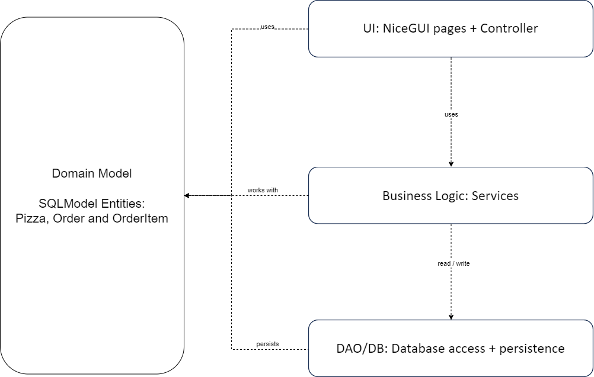
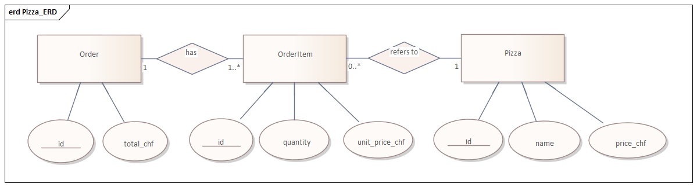
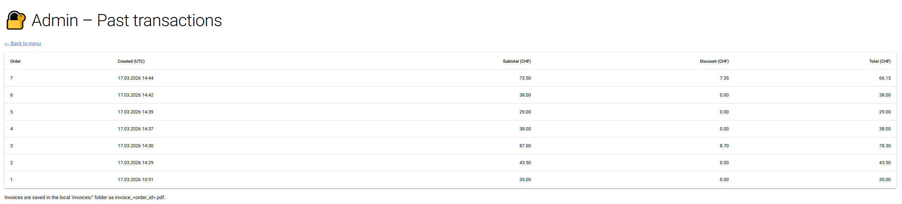

# E-LIF-E (Browser App)


---

This project demonstrates the development of a browser-based application using **NiceGUI**, focusing on clean architecture, data validation, and database integration via an ORM.

It aims to:

- Cover the full process from **requirements analysis to implementation**
- Apply advanced **Python** concepts in a web-based application
- Demonstrate **data validation**, layered architecture, and ORM usage
- Produce clean, maintainable, and well-tested code
- Support **teamwork and professional documentation**

---

## 📝 Application Requirements

### Problem

Users want to track their daily health habits (sleep, mood, stress, etc.), but without a structured system, it is difficult to evaluate and improve their lifestyle.

---

### Scenario

The application allows users to:

- enter daily health data (sleep, mood, stress, etc.) through simple input questions
- receive an automatically calculated wellness score (0–100) based on their inputs
- get personalized feedback and recommendations based on their score
- store daily entries in the system to track progress over time
- view daily, weekly, and monthly reports of their health data
- create an account and log in to access their personal data

---

## 📖 User Stories

### 1. Track Daily Habits 
**As a user, I want to answer simple daily questions in ≤ 60 seconds so that tracking is efficient.**

- **Inputs:** health data (see below)
- **Outputs:** wellness score (0–100), feedback

---

### 2. View Reports
**As a user, I want to receive daily, weekly, and monthly reports so that I can track my progress.**

- **Inputs:** stored data
- **Outputs:** aggregated report
 

---

### 3. Get Personalized Feedback
**As a user, I want to receive personalized advice based on my input so that I can improve my lifestyle.**

- **Inputs:** wellness score
- **Outputs:** recommendation text

---

### 4. Save History
**As a user, I want my data to be stored so that I can review past results.**

- **Inputs:**  

| Input              | Type  | Range / Validation        |
| ------------------ | ----- | ------------------------- |
| Username           | str   | length 3–20               |
| Sleep Quality      | int   | 0–10                      |
| Mood               | int   | 0–10                      |
| Stress             | int   | 0–10                      |
| Water Intake       | float | 0.0–5.0 liters            |
| Step Count         | int   | 0–50,000                  |
| Working Hours      | float | 0–16                      |
| Lifestyle (yes/no) | bool  | True / False              |
| Period Pain        | int   | 0–10                      |
| Period Flow        | int   | 1=low, 2=medium, 3=strong |

- **Outputs:** stored history


---

### 5. Account Management
**As a user, I want to create an account so that my data is personalized.**

- **Inputs:** username, password [String], [String]
- **Outputs:** account created [String]

As a User, I want to track my daily habits by answering simple, quick questions in not more than 1 minute in the app in order to be efficient.

---

### 6. Login
**As a user, I want to log in with my credentials so that I can access my data.**

- **Inputs:** username, password [String], [String]
- **Outputs:** access granted / denied [String]

I want to have an own account so that it would be personalised to my lifestyle or my habits.

---

## 🧩 Use Cases


- Enter Daily Health Data (User)
- Calculate Wellness Score (System)
- View Feedback (User)
- View Reports / History (User)
- Register Account (User)
- Login (User)
- Store Daily Entry (System)

### Actors
- User  
- System  

---

### Wireframes / Mockups

> 🚧 Add screenshots of the wireframe mockups you chose to implement.


---

## 🏛️ Architecture



### Layers
- **UI:** NiceGUI (browser-based interface)  
- **Application logic:** controllers and services  
- **Persistence:** SQLite + ORM + data access (DAO)  

### Design Decisions
- MVC structure (Model–View–Controller)
- Clear separation of concerns
- Business logic independent of UI

### Patterns Used
- MVC  
- Repository / DAO  
- Strategy (pricing rules)  
- Adapter (invoice generation)  

---

## 🗄️ Database and ORM



The application uses **SQLModel** to map domain objects to a SQLite database.

### Entities
- `User`
- `Habit_Definition`
- `Daily_Entry`
- `Wellness_Log`
- `Report`

### Relationships
- One `User` → many `Daily_Entry`
- Each `Daily_Entry` has one `Wellness_log`
- Each `Daily_Entry` contains many `Habit_Defintion`
- One `Report` references many `Daily_Entry`

---


## ✅ Project Requirements

---

> 🚧 Requirements act as a contract: implement and demonstrate each point below.

Each app must meet the following criteria in order to be accepted (see also the official project guidelines PDF on Moodle):

1. Using NiceGUI for building an interactive web app
2. Data validation in the app
3. Using an ORM for database management

---

### 1. Browser-based App (NiceGUI)

> 🚧 In this section, document how your project fulfills each criterion.

The application interacts with the user via the browser. Users can:

- View the pizza menu
- Select pizzas and quantities
- See the running total
- Receive an invoice generated as a file

**Architecture note (per SS26 guidelines):** the browser is a thin client; UI state + business logic live on the server-side NiceGUI app.

---

### 2. Data Validation

The application validates all user input to ensure data integrity and a smooth user experience.
These checks prevent crashes and guide the user to provide correct input, matching the validation requirements described in the project guidelines.

---

### 3. Database Management

All relevant data is managed via an ORM (e.g. SQLModel or SQLAlchemy). For the pizza example this includes users, pizzas, and orders.

---

## ⚙️ Implementation

### Technology

- Python 3.x  
- NiceGUI  
- SQLModel / SQLAlchemy  
- ReportLab  
- pytest  

---

### 📚 Libraries Used

- **nicegui** – UI framework  
- **sqlmodel** – ORM  
- **sqlalchemy** – database toolkit  
- **reportlab** – PDF generation  
- **python-dotenv** – configuration  
- **pytest** – testing  
- **pytest-cov** – coverage  

---

## 📂 Repository Structure

```text
pizza_app/
├── __init__.py
├── __main__.py
├── application.py
├── data_access/
│   ├── __init__.py
│   ├── dao.py
│   ├── db.py
│   └── seed.py
├── domain/
│   ├── __init__.py
│   └── models.py
├── services/
│   ├── __init__.py
│   ├── invoice_service.py
│   ├── order_service.py
│   ├── pizza_service.py
│   └── pricing_service.py

└── ui/
    ├── __init__.py
    ├── controllers.py
    └── pages.py
```
---

### How to Run

> 🚧 Adjust to your project.

### 1. Project Setup
- Python 3.13 (or the course version) is required
- Create and activate a virtual environment:
   - **macOS/Linux:**
      ```bash
      python3 -m venv .venv
      source .venv/bin/activate
      ```
   - **Windows:**
      ```bash
      python -m venv .venv
      .venv\Scripts\Activate
      ```
- Install dependencies:
   ```bash
   pip install -r requirements.txt
   ```

### 2. Configuration
- E.g., setup of parameters or environment variables

### 3. Launch
- Start the NiceGUI app (example):
   ```bash
   py -m pizza_app
   ```
- Open the URL printed in the console.

### 4. Usage (document as steps)

> 🚧 Describe the usage of the main functions

Order Pizza:
1. Open the menu page and browse pizzas.
2. Add items (with quantities) to the current order.
3. Review total (incl. discounts) and validate inputs.
4. Checkout to persist the order and generate the invoice.

> 🚧 Add UI screenshots of the main screens (or a short video link):




---

## 🧪 Testing

> 🚧 Explain what you test and how to run tests.

**Test mix:**
- Overall 12 tests
- 6 Unit tests: e.g. subtotal calculation, discount application above CHF 50, no discount at or below threshold, total calculation
- 3 DB tests: e.g. menu query returns seeded pizzas, saving an order persists order + order items, empty DB / empty transactions behavior
- 3 Integration tests: e.g. checkout with one pizza creates order and invoice, checkout with multiple pizzas applies discount correctly

**Template for writing test cases**
1. Test case ID – unique identifier (e.g., TC_001)
2. Test case title/description – What is the test about?
3. Preconditions: Requirements before executing the test
4. Test steps: Actions to perform
5. Test data/input
6. Expected result
7. Actual result
8. Status – pass or fail
9. Comments – Additional notes or defect found

---

## 👥 Team & Contributions

> 🚧 Fill in the names of all team members and describe their individual contributions below.

| Name      | Contribution |
|-----------|--------------|
| Student A | NiceGUI UI + documentation |
| Student B | Database & ORM + documentation |
| Student C | Business logic + documentation |

---

## 🤝 Contributing

> 🚧 This is a template repository for student projects.  
> 🚧 Do not change this section in your final submission.

- Use this repository as a starting point by importing it into your own GitHub account  
- Work only within your own copy — do not push to the original template  
- Commit regularly to track your progress  

---


## 📝 License

This project is provided for educational use only as part of the Advanced Programming module.

MIT License